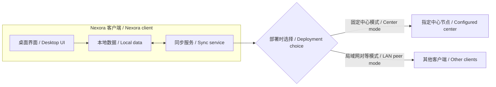

# Nexora ERP（联光 ERP）

面向财务、库存、销售、人力资源与客户关系管理的开源模块化 ERP 项目。

*An open-source, modular ERP project for finance, inventory, sales, HR, and CRM.*

[简体中文](#中文) · [English](#english)

## 简体中文

> **项目状态：基础框架已建立。** 目前可以运行 Electron + Vue 3 + TypeScript 桌面启动页；ERP 业务模块、数据持久化和同步能力仍处于规划阶段，尚无安装包。下文的业务与同步架构是设计目标，不代表已经实现。

### 项目愿景

Nexora（联光 ERP）计划以桌面客户端为主要入口，让每台客户端都能独立保存本地数据，并根据部署配置选择一种同步方式：连接指定的固定中心，或与同一局域网内的其他客户端对等同步。项目计划逐步覆盖以下业务模块：

- 财务管理：凭证、收支与报表。
- 库存管理：物料、出入库与盘点。
- 销售管理：客户订单与销售流程。
- 人力资源管理：人员资料与组织信息。
- CRM：客户资料与跟进记录。

模块范围和具体功能会随需求设计逐步确定。

### 架构设想

每台客户端计划包含桌面界面、本地数据存储和同步服务。**部署时选择一种同步模式**：

| 模式 | 计划行为 |
| --- | --- |
| 固定中心模式 | 客户端连接部署时指定的中心节点，通过它交换和协调数据。 |
| 局域网对等模式 | 客户端发现同一局域网中可达的其他节点，直接交换数据，不要求固定中心节点持续在线。 |

两种模式都以本地可用为目标：操作先保存在当前客户端，待中心节点或其他客户端可达时再同步。数据交换至少需要两个可通信的节点；只有一台客户端在线时，可以继续本地工作，但无法与离线客户端即时合并。两种模式之间不承诺自动切换或同时运行。

同步协议、节点身份验证和冲突处理规则仍待设计。库存、财务等关键数据不能简单地按最后写入时间覆盖；相关变更需要可审计的业务规则，必要时由人员复核。当前不承诺所有冲突都能自动、无损合并。

### 技术方向

| 层次 | 技术 | 状态与预期用途 |
| --- | --- | --- |
| 桌面应用 | Electron、Vue 3、TypeScript | **已建立基础框架**；包含桌面窗口、Vue 页面和受限的进程间接口。 |
| 后端服务 | FastAPI、Python | **已建立基础服务**；健康检查与接口文档，详见 [后端开发说明](backend/README.md)。 |
| 本地存储 | SQLite | **候选**；为每台客户端保存业务数据。 |
| 数据访问 | Drizzle ORM | **候选**；管理类型化查询与数据库迁移。 |
| 局域网发现 | mDNS | **候选**；发现同一局域网内的对等节点。 |
| 节点通信 | WebSocket | **候选**；传输节点间的同步消息。 |
| 数据合并 | 操作日志、CRDT | **候选**；按数据类型评估增量同步与合并策略，不能直接套用于所有 ERP 数据。 |

项目使用 electron-vite 构建主进程、预加载脚本和渲染进程。候选技术尚未最终选型，也没有在本仓库中实现。

### 开始使用与路线图

开发环境需要 Node.js 22.12 或更新版本，以及 npm。克隆仓库后，在项目根目录运行：

1. `npm install`：安装依赖和 Electron 运行时。
2. `npm run dev`：启动开发服务器和桌面窗口。
3. `npm run typecheck`：检查主进程与 Vue 页面的 TypeScript 类型。
4. `npm run build`：执行类型检查并构建到 `out/`。
5. `npm run preview`：使用构建结果启动桌面窗口。

这些命令只用于开发和预览，目前不会生成可分发的安装包。

后端已选用 FastAPI。按 [后端开发说明](backend/README.md) 启动独立服务后，桌面页会显示连接状态并支持重试；后端未启动不影响桌面窗口打开。

已完成桌面窗口、Vue 启动页、受限的版本查询接口和开发构建脚本。计划中的后续工作方向（不代表完成顺序或发布日期）：

1. 设计业务模块、数据模型和本地持久化方式。
2. 实现固定中心与局域网对等两种可选同步模式。
3. 验证离线恢复、冲突处理、数据安全与跨平台打包。

### 参与贡献

欢迎通过 [Issues](https://github.com/zhangzzj2003/Nexora-Erp/issues) 讨论需求、架构和文档，也欢迎提交 [Pull Request](https://github.com/zhangzzj2003/Nexora-Erp/pulls)。在项目仍处规划阶段时，请将技术方案和实际实现状态明确区分。

### 许可证

本项目采用 [Apache License 2.0](LICENSE)。

---

## English

> **Project status: foundation ready.** The Electron + Vue 3 + TypeScript desktop starter can run. ERP modules, persistent business data, and synchronization are still planned, and there is no installer yet. The business and sync architecture below are design goals, not implemented capabilities.

### Vision

Nexora ERP plans to use a desktop application as its main interface. Each client is intended to keep its own local data and use one synchronization mode selected at deployment: a configured fixed center or peer-to-peer synchronization with other clients on the same LAN. The planned business areas are:

- Finance: vouchers, income and expenses, and reports.
- Inventory: materials, stock movements, and stocktaking.
- Sales: customer orders and sales workflows.
- Human resources: personnel records and organizational information.
- CRM: customer records and follow-up activities.

The scope and details of these modules will be refined as requirements are developed.

### Proposed architecture

Each client is planned to contain a desktop UI, local data storage, and a synchronization service. **One synchronization mode is selected at deployment:**

| Mode | Intended behavior |
| --- | --- |
| Fixed-center mode | Clients connect to a center configured for the deployment to exchange and coordinate data. |
| LAN peer mode | Clients discover reachable peers on the same LAN and exchange data directly, without requiring a permanently online fixed center. |

Both modes aim to support local work: changes are saved on the current client first and synchronized when the center or another client becomes reachable. Data exchange requires at least two nodes that can communicate. If only one client is online, it can continue working locally, but it cannot immediately merge changes from offline clients. Automatic switching between modes and running both modes at once are not part of this design.

The [architecture diagram above](#架构设想) illustrates the client and the two deployment choices. The synchronization protocol, node authentication, and conflict rules still need to be designed. Critical data such as inventory and finance cannot simply be overwritten by the latest write; those changes need auditable business rules and, when necessary, human review. Automatic, lossless resolution of every conflict is not promised.

### Technology direction

| Layer | Technology | Status and intended use |
| --- | --- | --- |
| Desktop application | Electron, Vue 3, TypeScript | **Foundation implemented** with a desktop window, Vue UI, and a restricted process bridge. |
| Backend | FastAPI, Python | **Foundation implemented**; health endpoint and API documentation. See [backend setup](backend/README.md). |
| Local storage | SQLite | **Candidate** for storing business data on each client. |
| Data access | Drizzle ORM | **Candidate** for typed queries and database migrations. |
| LAN discovery | mDNS | **Candidate** for discovering peers on the same LAN. |
| Node communication | WebSocket | **Candidate** for synchronization messages between nodes. |
| Data merging | Operation log, CRDT | **Candidates** to evaluate for incremental synchronization and data-specific merge rules; they are not suitable as a blanket policy for all ERP data. |

The project uses electron-vite to build the main process, preload script, and renderer. The candidate technologies have not been finalized or implemented in this repository.

### Getting started and roadmap

Development requires Node.js 22.12 or newer and npm. After cloning the repository, run these commands from the project root:

1. `npm install` to install dependencies and the Electron runtime.
2. `npm run dev` to start the development server and desktop window.
3. `npm run typecheck` to check TypeScript in the main process and Vue UI.
4. `npm run build` to type-check and build into `out/`.
5. `npm run preview` to launch the desktop window from the build output.

These are development and preview commands; they do not produce a distributable installer yet.

The backend uses FastAPI. Follow the [backend setup](backend/README.md) to run it separately. The desktop page checks its health and supports retry; the desktop window can open while the backend is offline.

The desktop window, Vue starter page, restricted version-query bridge, and development/build scripts are in place. Planned next work areas (without a committed order or release date):

1. Design business modules, data models, and local persistence.
2. Implement selectable fixed-center and LAN peer synchronization modes.
3. Validate offline recovery, conflict handling, data security, and cross-platform packaging.

### Contributing

You are welcome to discuss requirements, architecture, and documentation in [Issues](https://github.com/zhangzzj2003/Nexora-Erp/issues), or submit a [Pull Request](https://github.com/zhangzzj2003/Nexora-Erp/pulls). While the project is in planning, please distinguish proposed designs from implemented behavior.

### License

This project is licensed under the [Apache License 2.0](LICENSE).
